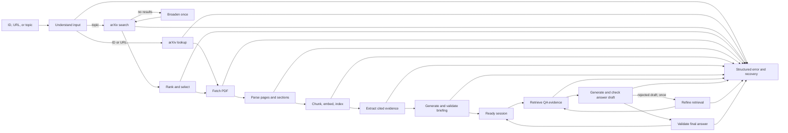

# Autonomous arXiv Paper Digest & QA Agent

A local Python agent that accepts an arXiv ID, URL, or research topic; selects and reads a paper; writes a source-linked executive briefing; and answers follow-up questions from that paper. It uses LangGraph, [Ollama](https://ollama.com/download) with **Qwen2.5:3b**, MiniLM embeddings, and a local Chroma index. No paid API key is required.

## Setup

Use Python **3.11**. The project was tested on an Apple M1 MacBook Air with 8 GB RAM. Internet access is needed for the initial package/model downloads and arXiv requests.

```sh
git clone https://github.com/Ansh1707/autonomous-arxiv-paper-digest-qa-agent.git
cd autonomous-arxiv-paper-digest-qa-agent
python3.11 -m venv .venv
source .venv/bin/activate
python -m pip install -r requirements.lock
python -m pip install --no-deps --no-build-isolation .
ollama pull qwen2.5:3b
python -m arxiv_agent doctor --download-models
python -m arxiv_agent doctor --smoke
```

Start the Ollama app before the two `doctor` commands, or run `ollama serve` in another terminal. The first `doctor` command downloads the pinned MiniLM model and Qwen tokenizer; `--smoke` checks a real local generation, embedding, and Chroma reopen. Configuration overrides are shown in [.env.example](.env.example). Model inference can be slow on an 8 GB machine.

## Run

```sh
# Specific paper ID or arXiv URL
python -m arxiv_agent brief-paper 2106.09685v1
python -m arxiv_agent brief-paper https://arxiv.org/abs/2106.09685v1

# Topic search: rank up to ten arXiv candidates and brief the top match
python -m arxiv_agent brief-paper "low-rank adaptation of language models"

# Ask a question about an already briefed paper
python -m arxiv_agent ask-paper 2106.09685v1 "What does LoRA freeze during training?"

# Continue a saved session using the session_id returned by ask-paper
python -m arxiv_agent chat --session SESSION_ID
```

`brief-paper` writes a Markdown briefing and an audit JSON file to `outputs/`. `ask-paper` returns an answer, copied support quotes, PDF-page citations, and a session ID. In interactive `chat`, use `/sources` for the latest citations and `/exit` to stop. Runtime data, downloaded PDFs, models, and sessions are local and excluded from Git. Run `python -m arxiv_agent --help` for the stage-by-stage CLI commands.

## State graph



LangGraph passes a typed `SessionState` between nodes. It contains the interpreted intent, candidate metadata, selected paper/version, PDF and parse references, Chroma index fingerprint, evidence, briefing, current question, retrieved chunks, answer/citations, conversation history, retrieval recovery count, retries, and errors. The briefing graph stops at `ready`; each QA turn runs a separate retrieve → answer → validate graph and saves a session snapshot. If both attempts to repair an invalid answer draft fail, the graph makes one deeper retrieval pass with a focused query and gives newly found passages priority. It validates the final answer or abstains if no new support is found. Reopening checks the saved paper, artifacts, and index before answering again. Empty searches, failed downloads, and unreadable PDFs return explicit recovery errors.

## Example run: LoRA paper

Input: `python -m arxiv_agent brief-paper 2106.09685v1`

Excerpt from the generated briefing (bibliographic fields and claim wording retained):

> **LoRA: Low-Rank Adaptation of Large Language Models** — Edward J. Hu, Yelong Shen, Phillip Wallis, Zeyuan Allen-Zhu, Yuanzhi Li, Shean Wang, Weizhu Chen. [arXiv:2106.09685v1](https://arxiv.org/abs/2106.09685v1), published 2021-06-17.
>
> **Why this paper matters:** One of the main drawbacks for full fine-tuning is that for each downstream task, we learn a different set of parameters ∆Φ whose dimensions |∆Φ| equals |Φ0|. [PDF p. 2](https://arxiv.org/pdf/2106.09685v1#page=2)
>
> **Problem:** One of the main drawbacks for full fine-tuning is that for each downstream task, we learn a different set of parameters ∆Φ whose dimensions |∆Φ| equals |Φ0|. [PDF p. 2](https://arxiv.org/pdf/2106.09685v1#page=2)
>
> **Method:** During training, W0 is frozen and does not receive gradient updates, while A and B contain trainable parameters. [PDF p. 3](https://arxiv.org/pdf/2106.09685v1#page=3)
>
> **Key result:** LoRA outperforms several baselines with comparable or fewer trainable parameters. [PDF p. 7](https://arxiv.org/pdf/2106.09685v1#page=7)
>
> **Limitation:** For example, it is not straightforward to batch inputs to different tasks with different A and B in a single forward pass, because we absorb A and B into W to prevent additional inference latency. [PDF p. 4](https://arxiv.org/pdf/2106.09685v1#page=4)
>
> **Suggested follow-ups:** What is the main drawback of full fine-tuning according to the passage? How does LoRA differ from other methods in the number of trainable parameters? Can you provide more details on the three datasets used in the experiments?

Three recorded QA exchanges from the same paper (generation wording may vary):

| Question | Answer | Evidence |
| --- | --- | --- |
| What does LoRA freeze during training? | LoRA freezes the pre-trained model weights and injects trainable rank decomposition matrices into each layer of the Transformer architecture, reducing the number of trainable parameters for downstream tasks. | [PDF p. 1](https://arxiv.org/pdf/2106.09685v1#page=1) |
| For GPT-3, by how much can LoRA reduce trainable parameters compared with full fine-tuning? | LoRA can reduce the number of trainable parameters by 10,000 times compared to full fine-tuning for GPT-3. | [PDF p. 1](https://arxiv.org/pdf/2106.09685v1#page=1) |
| What batching limitation does LoRA explicitly report? | LoRA explicitly reports a limitation where it is not straightforward to batch inputs to different tasks with different A and B in a single forward pass. | [PDF p. 4](https://arxiv.org/pdf/2106.09685v1#page=4) |

For an unsupported question such as “What is the first author's favorite food?”, the agent responds: “I couldn’t find enough evidence in the retrieved paper text to answer that.” It gives no citation.

## Grounding evaluation

Run the saved, fixed-question challenges with the local Qwen model and fresh paper briefings:

```sh
PYTHONPATH=src python evaluation/run.py
PYTHONPATH=src python evaluation/run.py --cases evaluation/holdout_cases.json --output evaluation/holdout_results.json
```

The [development results](evaluation/results.json) cover DPO and SimCLR (8 answerable questions, 2 unsupported questions); the [third-paper results](evaluation/holdout_results.json) cover chain-of-thought prompting (3 answerable, 1 unsupported). On the recorded run, all 11 answerable questions received cited answers and all 3 unrelated questions abstained. This is a **small development challenge**, not an untouched estimate of accuracy across arXiv: failures on these papers informed code changes. The case files, exact answers, copied support quotes, and citation metadata are committed so reviewers can inspect every claim. Exact expected-term matching succeeds for 8 of 11 answerable answers. The three misses use “binary cross entropy” for “classification,” “nonlinear transformation” for “projection head,” and “∼100B parameters” for “large.” The middle answer conveys the transformation but does not name the projection head, so it is less precise than desired. PDF line-break artifacts and figure text also make some copied answers verbose. Review cited PDF pages for high-stakes use; these checks do not prove general semantic entailment.

## Design Decisions & Tradeoffs

I chose one selected paper per session so the briefing and QA citations stay tied to a specific arXiv version. Topic searches use the official arXiv API and rank at most ten candidates with local MiniLM embeddings; direct IDs bypass ranking. The agent uses explicit graph stages rather than one long prompt, making retries, errors, and saved state visible. Chroma persists page-aware chunks, and QA sessions retain the selected paper, index fingerprint, and conversation turns, so a follow-up can reopen without fetching or embedding the paper again.

Qwen2.5:3b runs locally without a paid API key and fits the test machine, but a small model can misread flattened tables or combine nearby facts. The agent therefore checks cited paper/version, copied source text, numbers, requested benchmark or model size, key actions, and whether each generated claim is supported by one quoted sentence. An uncertain paraphrase can be replaced by a relevant source sentence. A rejected answer draft can trigger one wider retrieval pass; if it finds no new passage or the second draft still fails, the agent abstains. This favors grounded answers over coverage and can reject an answer that is true but poorly retrieved. PDF downloads and page counts are bounded, and image-only or text-poor PDFs fail clearly because OCR is not implemented.

With more time, I would test on a larger truly unseen paper set, recover table/equation structure more reliably, add OCR for scanned papers, and compare a stronger local model under the same citation checks. The current tests and three-paper challenge do not establish general accuracy across arXiv. There is no frontend, deployment, non-arXiv ingestion, or model fine-tuning because the assessment calls for a focused local agent.

Run the offline checks with `python -m pytest` and `python -m ruff check .`.
