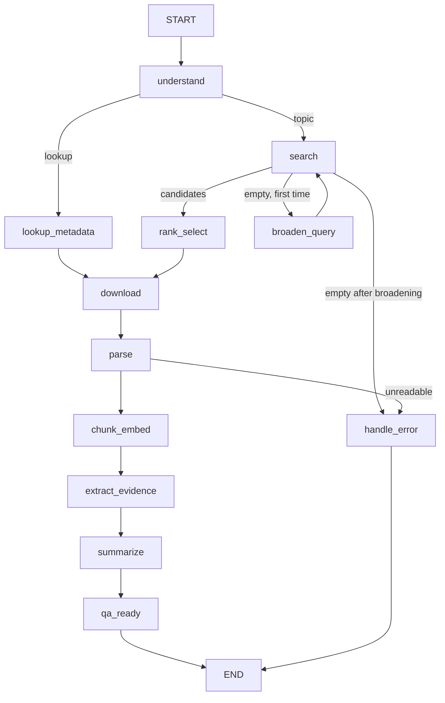
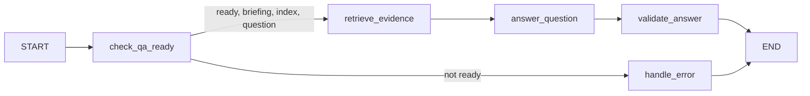

# Foundation architecture

This document describes the Steps 1–4 skeleton plus live Steps 5–15 input understanding,
metadata discovery, paper selection, PDF acquisition, text extraction, indexing, and evidence
selection and briefing. All `demo` services are synthetic. `inspect-input` runs one real LangGraph
node and can call local Qwen for research topics. `discover` then calls the official arXiv API.
Paper embedding, persistent indexing, source-bound briefing, and grounded QA are implemented.

The Step 5 graph is `START → understand → END`, with a conditional route to `handle_error`.
It returns a normalized ID for direct lookup, or a validated topic intent containing up to
five terms, authoritative date bounds from the user text, and a Python-built arXiv query.
Malformed IDs/URLs or unsupported dates enter the error node. A missing/invalid model output
uses sanitized input terms and records a warning. Topic dates are never silently dropped.

The Step 6 graph routes to `lookup_metadata` for an ID or `search` for a topic, then ends
before ranking or download. Topic search returns at most ten candidates. An empty search routes
through `broaden_query` once, preserving date bounds; a second empty result is a clear error.
Versioned lookups require the exact version, while unversioned lookups record the version arXiv
returns. Successful metadata responses are cached for 24 hours. A single client spaces API
attempts by at least three seconds, sets a 20-second timeout, and relies on graph retries for
at most two further attempts on transient errors.

The Step 7 graph adds `rank_select` after a successful topic search, then ends before PDF
download. MiniLM ranks the title and abstract separately against the interpreted topic terms
using 0.6/0.4 cosine weighting. The highest score is selected by default; `--select N` records
an explicit override. Ties retain API order. ID/URL lookup bypasses ranking and selects the
resolved paper directly. Scores, the ordered candidate list, selected version, rank, and
selection source stay in `SessionState`.

The Step 8 graph adds `download` after either direct lookup or topic selection and ends
before parsing. The downloader constructs the versioned arXiv PDF URL from validated metadata,
streams into a temporary file with size and time limits, checks PDF structure and page count,
then records a SHA-256 checksum and manifest beside the PDF. A cache hit is accepted only after
size, checksum, version, and structural validation. Redirects stay on approved arXiv HTTPS
hosts. Temporary failures use the graph's two-retry budget; invalid content stops immediately.

The parser rechecks the PDF checksum, extracts text blocks in page order, applies a two-column
reading-order heuristic,
and labels section headings, captions, the abstract, and numbered references. It stores a
versioned JSON record with each block's page and bounding box. Image-only/text-poor PDFs fail
with `UNREADABLE_PDF`; metadata abstract fallback and missing references are visible warnings.
The Step 10 graph adds `chunk_embed` after `parse` and ends before evidence extraction. Chunks
stay within one page and section, retain source block IDs, and are capped by MiniLM tokens.
Chroma stores their normalized embeddings and provenance under a fingerprint of the selected
paper, PDF, parsed text, model revision, and chunk settings.
The Step 11 graph adds `extract_evidence` and stops before `summarize`. It selects verbatim
chunks for the problem, method, and results, prioritizing relevant main-paper sections and
excluding references. A conservative pattern finds explicit limitations of the selected
paper; absence is recorded as `not_found` for later briefing generation. Evidence records carry
the chunk ID, page, section, and source block IDs, and are saved under `data/evidence`.
The Step 12 graph adds `summarize` and stops before `qa_ready`. Qwen2.5:3b drafts short fields
from the selected passages. The builder checks citations, exact source text, and numbers before
writing Markdown and JSON artifacts. Bibliographic fields are copied from metadata. Dense
tables use caption comparisons to avoid guessing row-to-metric associations. Human review is
still needed for subtle semantic support; structural checks cannot prove entailment.
Step 13 adds a full-body, Qwen-token-bounded batch audit and preserves candidate notes before
reduction. Step 14 tightens the briefing to three distinct follow-up questions, keeps
processing caveats separate from reported paper limitations, and copies suitable explicit
result sentences to preserve qualifiers that a paraphrase could weaken.

## Digest graph

Every service node also has a conditional error edge to `handle_error` and a self-edge for
explicitly retryable failures. Two retries means at most three calls, not three retries.
Non-retryable errors stop immediately. Topic broadening is separate and happens at most once.
The compiled graph has a recursion limit of 100 as an additional guard. The live discovery
service enforces API pacing, including failed requests; synthetic retries have no sleep.
Run `python -m arxiv_agent graph` to view all actual compiled edges, including retry self-edges.

## QA turn graph

`ask-paper` and `chat` invoke the QA graph once per question. No graph node reads stdin. A validated
`b3` briefing and `e4` evidence reconstruct an in-memory ready state for the selected paper.
The retrieval node queries 12 candidates, adds exact-term matches, removes near-duplicates,
excludes references unless requested, and selects up to six chunks within a Qwen-token budget.
Short history contains only prior user questions and helps resolve referential follow-ups;
it never substitutes for fresh paper evidence. Qwen returns one answer and source IDs. The
answer and validation nodes check selected-paper citations, numeric values, and key actions
against copied source sentences, then append the turn. Invalid answers get one repair attempt
and then abstain. The graph rejects QA after a failed parse or incomplete briefing; each new
turn gets a fresh per-node retry budget.

## Shared state

`SessionState` is a Pydantic model passed to LangGraph `StateGraph`. Each node receives a deep
copy through the injected `WorkflowServices.run_stage(stage, state)` interface and returns
partial updates. Updates are validated against the whole state before the graph applies them.
Unknown fields, invalid nested records and missing stage outputs fail through the error node.

| Group | Fields |
| --- | --- |
| Identity | schema_version, session_id, execution_mode, user_input, timestamps |
| Workflow | stage, status, intent (ID or topic, terms, dates, arXiv query), stage_history |
| Discovery | candidates and scores, selected_paper, selection_rank/source, search_broadened |
| Artifacts | pdf_path/checksum/pages/size, parsed_path, sections, abstract source, reference count, page-aware blocks in parsed JSON, index reference, output_paths |
| Briefing | evidence_notes, evidence_path, limitations_evidence_status, briefing |
| QA | question, retrieval_query, retrieved_chunks, answer, answer_support_quotes, conversation |
| Reliability | error, retry_counts, timings_seconds, warnings |

No client handles, open files, vector arrays or model instances are stored in state. JSON
round-tripping is tested. Ready live sessions are written as private, atomic JSON snapshots
after each successful turn. Reopening validates the selected briefing, evidence, paper/version,
and Chroma index identity before another graph invocation. The demo
does not write fictional artifacts. Its `synthetic://` paths are identifiers, not real files.

## Contracts and validation boundaries

- PaperMetadata preserves publication and update dates, authors, abstract, links and version.
- Chunk carries section, one-based PDF page span, version, stable ID and embedding token count.
- Briefing requires all assessment fields and distinguishes reported limitations from not found.
- EvidenceClaim carries text and nonempty source IDs. QAAnswer requires citations when answered.
- WorkflowError carries stage, code, message, recovery advice and an explicit retryable flag.
- QA citations and copied support sentences are checked against selected-paper retrieval.
  Structural checks cannot prove every subtle entailment; manual evaluation remains necessary.

## Environment

Settings use the `ARXIV_AGENT_` environment prefix and optional `.env` file. Defaults select
Qwen2.5 3B, a 4,096-token context, CPU embeddings and local Ollama. Invalid chunk limits,
nonlocal model endpoints, retry counts and incompatible model tags fail early. Directory
creation happens only through explicit diagnostics/setup; imports do not create data folders.

`doctor` does not fetch paper data. Optional smoke checks use a tiny synthetic text, unload
Qwen after generation, embed on CPU and verify Chroma survives a separate writer process.
The embedding model and Qwen tokenizer are downloaded only with `--download-models`.

## Later milestones

Keep the graph, contracts and offline regression suite. Next add broader scored QA evaluation.
No external API, UI or deployment service is needed.
